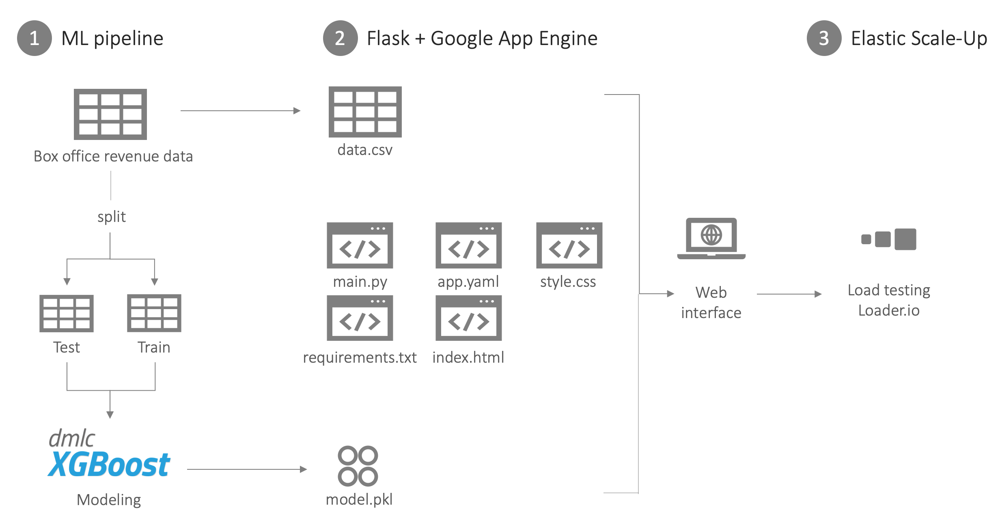
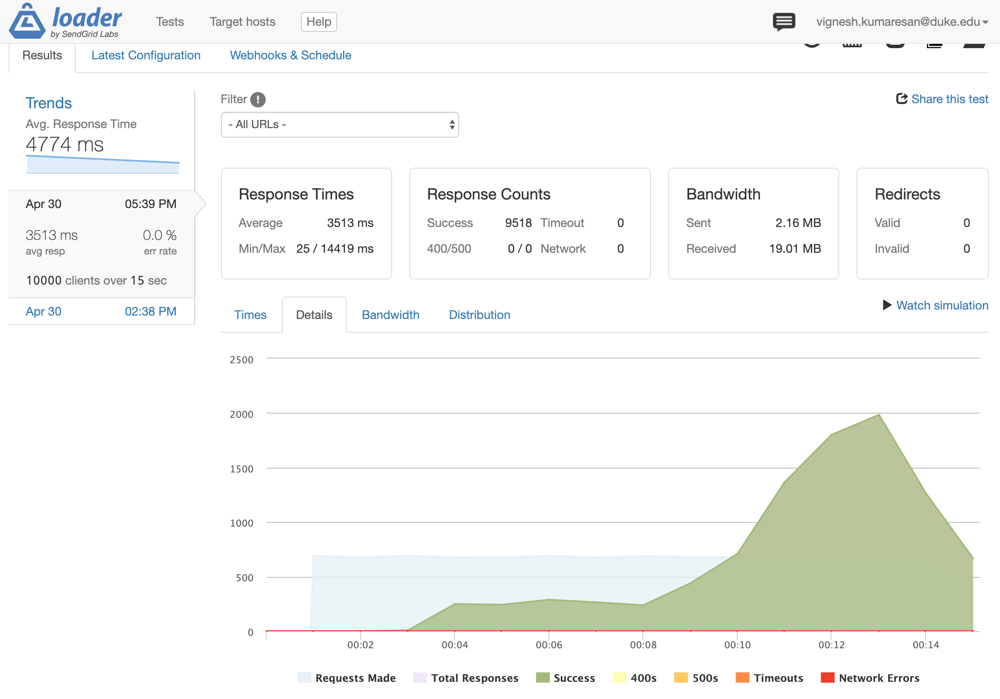

# Box Office Revenue Prediction Tool
Duke MIDS: Cloud Computing Final Project
Ana Belen Barcenas (@abbarcenasj), Viggy Kumaresan (@viggykumaresan), Danny Witt (@drwitt)

Link: https://box-office-revenue-prediction.ue.r.appspot.com/

## Objective
Build a machine learning prediction model, deploy it in Flask and Google App Engine, and integrate load testing into our deployment routine.

## Background
The film industry relies on investors and producer’s decisions that are driven by expected box office revenue. The predicted revenue is based on a variety of factors such as the month of release, marketing, reputation of the studio, and more. We present the development of a box office revenue prediction tool based on [previous work](https://www.kaggle.com/artgor/eda-feature-engineering-and-model-interpretation) in this space and take it into production to make it available for the public.

## Architecture
This project emulates the following workflow:

1. Build a machine learning model to predict box office revenue using XGBoost. The data comes from the Internet Movie Database (IMDB). Store the model code as a .pkl object that will be used in the next step.

2. Create a Flask application that consists of the following items:
3. HTML file for the frontend: allows the user to input values; in this case, the name of the movie.
4. CSS file for styling the web interface (fonts, buttons, background, etc.)
5. requirements.txt file to import all the necessary packages.
6. main.py file that accesses the model.pkl and data files to display information to the user.
7. Deploy the Flask application in Google App Engine standard environment. 
8. Access the resulting web interface and perform functional testing.

## Load Testing

We used [loader.io to](https://loader.io/) to load test our application. We tested 10000 client requests evenly over 15 seconds, and the results are shown in the graphic above. Overall, our application was able to handle this workload without any errors, but we will continue to to load test our application with varied workloads going forward.

## Resources
https://www.kaggle.com/c/tmdb-box-office-prediction

https://www.kaggle.com/artgor/eda-feature-engineering-and-model-interpretation

https://codelabs.developers.google.com/codelabs/cloud-vision-app-engine/index.html?index=..%2F..index#8

https://towardsdatascience.com/how-to-easily-deploy-machine-learning-models-using-flask-b95af8fe34d4
